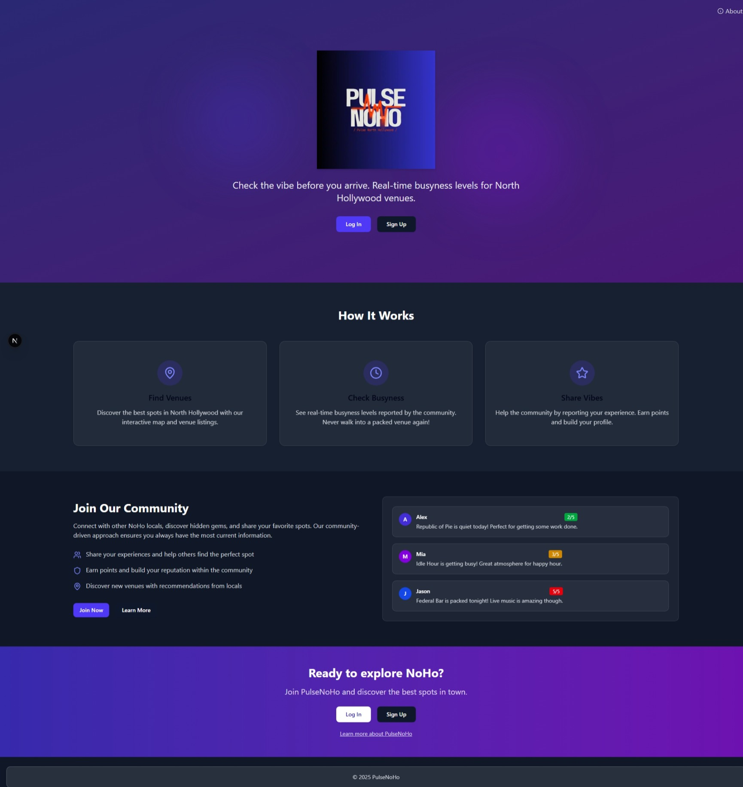

# PulseNoHo

Check the vibe before you arrive. A real-time venue crowd monitoring app for North Hollywood, built with Next.js and Firebase.



## About

PulseNoHo is a community-driven platform designed to help people discover the real-time vibe of venues in North Hollywood. Whether you're looking for a quiet coffee shop to work from, a lively bar for Friday night, or a moderate-energy restaurant for a dinner date, PulseNoHo provides real-time insights from the community.

## Features

- **Real-time Venue Monitoring**: See how busy venues are right now
- **Vibe Check System**: Submit and view crowd levels on a 1-5 scale
- **User Authentication**: Create an account to participate
- **Point System**: Earn points for contributing venue vibes
- **User Profiles**: Customize your profile and follow other users
- **Social Features**: Follow other users and view their activity
- **Direct Messaging**: Chat with other community members
- **Admin Dashboard**: Manage venues and users (admin only)
- **Heat Map**: Visual representation of venue busyness across NoHo
- **Community Forum**: Share thoughts and tips about NoHo venues

## Tech Stack

- **Frontend**: Next.js 13+ (App Router), React, Tailwind CSS
- **Backend**: Firebase (Authentication, Firestore, Storage)
- **Mapping**: Google Maps API
- **UI Components**: shadcn/ui
- **Notifications**: react-hot-toast

## Getting Started

### Prerequisites

- Node.js 16+
- npm or yarn
- Firebase project
- Google Maps API key

### Installation

1. Clone the repository:
   ```bash
   git clone https://github.com/yourusername/pulsenoho.git
   cd pulsenoho
   ```

2. Install dependencies:
   ```bash
   npm install
   # or
   yarn
   ```

3. Create a `.env.local` file with your Firebase and Google Maps credentials:
   ```
   NEXT_PUBLIC_FIREBASE_API_KEY=your-api-key
   NEXT_PUBLIC_FIREBASE_AUTH_DOMAIN=your-auth-domain
   NEXT_PUBLIC_FIREBASE_PROJECT_ID=your-project-id
   NEXT_PUBLIC_FIREBASE_STORAGE_BUCKET=your-storage-bucket
   NEXT_PUBLIC_FIREBASE_MESSAGING_SENDER_ID=your-messaging-sender-id
   NEXT_PUBLIC_FIREBASE_APP_ID=your-app-id
   NEXT_PUBLIC_GOOGLE_MAPS_API_KEY=your-google-maps-api-key
   ```

4. Start the development server:
   ```bash
   npm run dev
   # or
   yarn dev
   ```

5. Open [http://localhost:3000](http://localhost:3000) to view the app.

## Firebase Setup

1. Create a new Firebase project at [firebase.google.com](https://firebase.google.com)
2. Enable Authentication (Email/Password)
3. Set up Firestore Database with the following collections:
   - `users` - User profiles and social connections
   - `venues` - Venue information and metadata
   - `messages` - Direct messaging between users
   - `forum` - Community forum posts
4. Set up Firebase Storage for user avatars
5. Configure Firestore rules using the provided `firestore.rules` file

## Project Structure

```
pulsenoho/
├── public/           # Static assets
├── src/
│   ├── app/          # Next.js app directory
│   │   ├── admin/    # Admin dashboard 
│   │   ├── dashboard/# User dashboard
│   │   ├── profile/  # User profiles
│   │   ├── messages/ # Direct messaging
│   │   ├── venues/   # Venue details pages
│   │   └── about/    # About page
│   ├── components/   # Reusable React components
│   ├── contexts/     # Context providers (Auth, etc.)
│   ├── hooks/        # Custom hooks
│   ├── lib/          # Utility functions and Firebase setup
│   └── components/ui/# UI components (shadcn/ui)
├── .env.local        # Environment variables (not tracked)
├── next.config.js    # Next.js config
└── tailwind.config.js # Tailwind CSS config
```

## Firestore Security Rules

The application implements secure Firestore rules that:
- Restrict venue editing to admin users
- Allow users to follow/unfollow other users
- Secure direct messaging between participants
- Protect user data while enabling social features
- Allow authenticated users to submit venue feedback

## Feature Roadmap

- [ ] Venue photo uploads
- [ ] Venue owner accounts
- [ ] Events calendar
- [ ] Push notifications for venue status changes
- [ ] Dark/light theme toggle
- [ ] Mobile app version
- [ ] Favorite venues list
- [ ] Venue recommendations based on preferences
- [ ] Weekly venue trend reports

## License

This project is licensed under the MIT License - see the LICENSE file for details.

## Acknowledgments

- UI components powered by shadcn/ui
- Icons by Lucide React
- Mapping powered by Google Maps
- Backend infrastructure by Firebase
- Toast notifications by react-hot-toast

---

Feel free to contribute by opening issues or submitting pull requests!